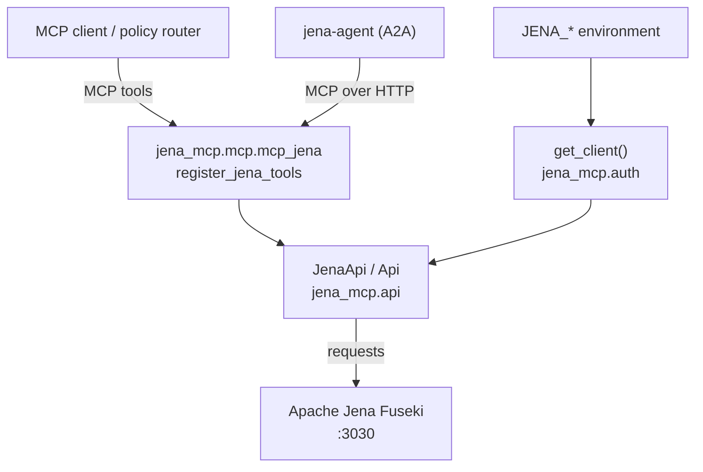

# Architecture — jena-mcp

`jena-mcp` is a thin, layered connector: a typed REST client at the base, MCP tool
wrappers above it, and an optional A2A agent server that orchestrates the same tools.

## Layers

## Request flow

1. An MCP client (or the `jena-agent` A2A server) invokes one of the three
   action-dispatch tools: `jena_sparql`, `jena_graph`, or `jena_admin`.
2. The tool wrapper resolves a `JenaApi` via `get_client()`, which reads the
   `JENA_*` environment variables, then dispatches the requested action to the
   matching client method.
3. `JenaApi` issues the corresponding Fuseki REST call — SPARQL Protocol, Graph
   Store Protocol, or the administration API — over `requests`.

## Design notes

- **Single source of API surface.** Every Fuseki interaction lives in
  `jena_mcp/api/`; the MCP wrappers add no business logic.
- **Action-dispatch tools.** Three coarse tools (rather than dozens) keep the agent
  tool budget small while still covering the full protocol surface.
- **Environment-driven configuration.** Connection settings come exclusively from
  `JENA_*` variables; the connector remains inactive when credentials are absent.

See [Overview](overview.md) for the tool/endpoint matrix and
[Concepts](concepts.md) for the stable concept registry.
