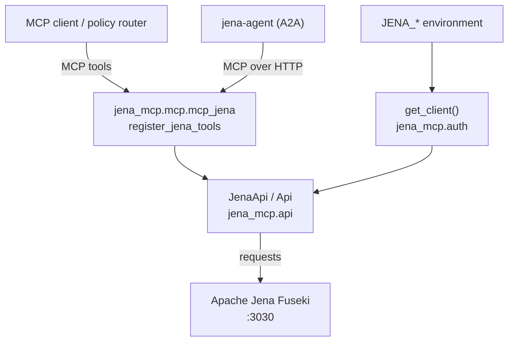

# Architecture — jena-mcp

`jena-mcp` is a thin, layered connector: a typed REST client at the base, MCP tool
wrappers above it, and an optional A2A agent server that orchestrates the same tools.

## Layers

```mermaid
flowchart TD
    A["MCP client / policy router"] -->|MCP tools| B["jena_mcp.mcp.mcp_jena<br/>register_jena_tools"]
    G["jena-agent (A2A)"] -->|MCP over HTTP| B
    B --> C["JenaApi / Api<br/>jena_mcp.api"]
    C -->|requests| D["Apache Jena Fuseki<br/>:3030"]
    E["get_client()<br/>jena_mcp.auth"] --> C
    F["JENA_* environment"] --> E
```

## Request flow

1. An MCP client (or the `jena-agent` A2A server) invokes one of the
   action-dispatch tools: `jena_sparql`, `jena_graph`, `jena_admin`, or the CA-45
   trio `jena_publish_owl_pack` / `jena_verify_pack_count` / `jena_partition_graph`.
2. The tool wrapper resolves a `JenaApi` via `get_client()`, which reads the
   `JENA_*` environment variables, then dispatches the requested action to the
   matching client method.
3. `JenaApi` issues the corresponding Fuseki REST call — SPARQL Protocol, Graph
   Store Protocol, or the administration API — over `requests`.

## Design notes

- **Single source of API surface.** Every Fuseki interaction lives in
  `jena_mcp/api/`; the MCP wrappers add no business logic, with one deliberate
  exception: the CA-45 OWL-pack trio carries a small amount of digest-conflict /
  count-comparison logic in `jena_mcp/mcp/mcp_jena.py` itself (idempotent-by-digest
  publish, `COUNT(*)` comparison, `urn:source:*` partition routing) — specific
  enough to this MCP surface that it does not belong in the generic `JenaApi`
  client.
- **Action-dispatch tools.** Coarse tools (rather than dozens) keep the agent
  tool budget small while still covering the full protocol surface.
- **Environment-driven configuration.** Connection settings come exclusively from
  `JENA_*` variables; the connector remains inactive when credentials are absent.

See [Overview](overview.md) for the tool/endpoint matrix and
[Concepts](concepts.md) for the stable concept registry.
